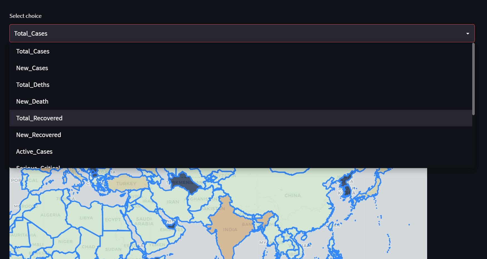
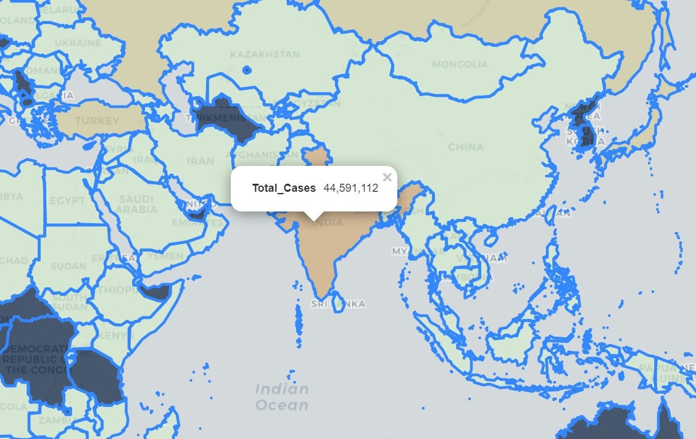

# Coworld

<br/>


<!-- ABOUT THE PROJECT -->
## **About The Project**
This project aims at displaying global covid-19 statistics in a easy to visualize chloropleth world map. 


<br/>
<br/>

## **Key features**
1. Web-scrapping covid-19 statistics from "https://www.worldometers.info/coronavirus/"
2. Convering values to csv and saving them to a file named "values.csv"
3. Using the csv to display values on a chloropleth world map
4. Choosing metrics whose statistics we want to see
5. Option to click on a country to see its values for the chosen metric

### **Technologies and Key Libraries used**

* [Python](https://www.python.org/)
* [Streamlit](https://streamlit.io/)
* [Folium](http://python-visualization.github.io/folium/)
* [Beautiful Soup](https://www.crummy.com/software/BeautifulSoup/bs4/doc/)

<br/>


### **Installation**
Anaconda must be installed on your system if running locally.

1. Clone the repo
   ```sh
   git clone https://github.com/Harsh-159/Coworld.git
   ```

2. Download all dependencies
   ```sh
   pip install -r requirements.txt
   ```
3. Run streamlit app
   ```sh
   streamlit run main.py
   ```
4. Click on the local URL which will look somthing like
   ```sh
   Local URL: http://localhost:8501
   ```
5. Wait for some time

<br/>

## **Screenshots**
<div align="center" ><br/>
Display on a chloropleth world map<br/><hr width=600/>
  <br/><br/>
Options to choose metrics whose statistics we want to know<br/><hr width=600/>
  <br/><br/>
Value seen after clicking<br/><hr width=600/>
  <br/>
</div>
<br/>


<!-- CONTACT -->
### **Contact**
Harsh Yadav - harshyadavhappy@gmail.com

<br/>
